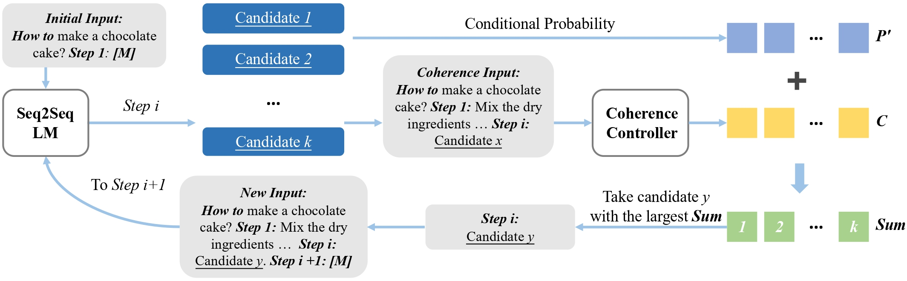

# <em>SubeventWriter</em>: Iterative Sub-event Sequence Generation with Coherence Controller

This repository is the official implementation of 
[<em>SubeventWriter</em>: Iterative Sub-event Sequence Generation with Coherence Controller](https://arxiv.org/abs/2210.06694). 

The paper is accepted to the main conference of EMNLP 2022.

<div align="center">
    
    <span>An Overview of Our Method</span>
</div>

[//]: # (## Citation)

[//]: # (Please cite our work if you make use of our code in your work:)

[//]: # (@misc{wang2022subeventwriter,)

[//]: # (      title={SubeventWriter: Iterative Sub-event Sequence Generation with Coherence Controller}, )

[//]: # (      author={Wang, Zhaowei and Zhang, Hongming and Fang, Tianqing and Song, Yangqiu and Wong, Ginny Y. and See, Simon},)

[//]: # (      year={2022},)

[//]: # (      eprint={2210.06694},)

[//]: # (      archivePrefix={arXiv},)

[//]: # (      primaryClass={cs.CL})

[//]: # (})


## Requirements
Python version is 3.8.5

requirements:
```setup
accelerate==0.13.1
bert_score==0.3.11
datasets==1.18.3
filelock==3.0.12
huggingface_hub==0.4.0
nltk==3.6.3
numpy==1.19.2
packaging==20.9
rouge_score==0.0.4
scikit_learn==1.1.2
spacy==2.3.2
torch==1.8.0+cu111
tqdm==4.63.1
transformers==4.17.0
```
You can install all requirements with the command
```
pip install -r requirements.txt
```

## Datasets
We extract a large dataset from WikiHow, containing 
(process, sub-event sequence) pairs. To get our WikiHow dataset, unzip the file
`datasets.zip`.
The data for training Seq2Seq LM is in `datasets/WikiHow_data_for_Seq2SeqLM`
The data for training Coherence Controller is `datasets/WikiHow_data_for_coherence_controller`
We also used SMILE 
[download](https://www.coli.uni-saarland.de/projects/smile/data/rkp_xml.zip) 
and DeScript [download](http://fedora.clarin-d.uni-saarland.de/sfb1102/index.html#descript) 
as out-of-distribution datasets.
We also provide two Python scripts to convert their `XML` files into `json` 
with the format we use in WikiHow data.
The order of using them:
- `OOD_dataset/convert_xml_to_json.py`: this file converts `XML` files in a dataset into `json` files.
- `OOD_dataset/reformat_json.py`: merges all json files into one and reorganizes to the format of WikiHow data


## Training
<em>SubeventWriter</em> contains two components that your need 
to fine-tune: a Seq2Seq LM that generates sub-events iteratively 
in the temporal order and a coherence controller.

### Step1: Fine-tune the Seq2Seq LM
First, you need to fine-tune a Seq2Seq LM.
Take training BART-base as an example:
```
sh training_script/single_gpu.sh 5e-5 4 32 1 32 facebook/bart-base LM AdamW /your/output/dir /your/data/dir
```
In this command, `5e-5 4 32 1 32` are learning rate, epoch, training batch size, 
gradient accumulation step, evaluation batch size. `facebook/bart-base LM AdamW`
are model name, prompt template type, optimizer.
You need to replace `/your/output/dir` with your own path to the folder 
where the fine-tuned model will be saved, `/your/data/dir` with your
own path where input data is saved.

You can also use multiple GPUs to fine-tune a large model, like T5-3b.
The arguments of `training_script/multi_gpu.sh` are the same as 
`training_script/single_gpu.sh`, except that you need to add a
gpu number after the model name. Here we use 2 GPUs to fine-tune
T5-3b.
```
sh training_script/multi_gpu.sh 5e-5 4 4 8 4 t5-3b 2 sentinel Adafactor /your/output/dir /your/data/dir
```

__What are prompt template type?__

Different pre-trained language models have different special tokens 
and different way to pre-train. To make input similar to the pre-training stage,
we write the prompt template `LM` for
BART and another `sentinel` for T5. These two models are the two 
Seq2Seq LM used in our experiments.

__How to get total batch size?__

We use gradient accumulation to get a bigger training batch size.
We may also have multiple gpu number.
The training batch size passed in arguments is not the total batch 
size. The formula is:
$$
Total_batch_size = training_batch_size \times gpu_number \times
gradient_accumulation_step
$$

__Whether your fine-tuned Seq2Seq LM can work?__

After training, our code will predict sub-event sequences using 
fine-tuned Seq2Seq LM. The results are saved in the folder `generation`
under `/your/output/dir`. There are four files. `generation/full_script_test.json`
and `generation/full_script_valid.json` are results of sub-event sequences given processes.
`generation/test.json` and `generation/valid.json` are results of next sub-event, given
process and prior sub-events. You can read the generation to judge.

__Command for other models:__
We fine-tuned BART-base/large and T5-base/large/3b. The commands to
fine-tune all sizes of models are included in `training_seq2seqlm/command.sh`.

### Step2: Train coherence controller
Second, you need to train a coherence controller. 
```
sh training_coco/train_coco.sh 1e-5 5 128 /your/output/dir /your/data/dir
```
In this command, `1e-5 5 128` are learning rate, epoch, training
batch size. Same as Step1, `/your/output/dir` and `/your/data/dir`
are folders of fine-tuned output and input data. The above command is also
included in `training_coco/command.sh`.

## Inference
Now, you can use your Seq2Seq LM to generate sub-event sequences
on validation and testing sets with the help of your coherence 
controller.
```
sh decoding/single_gpu.sh 2 64 LM /trained/seq2seqlm /trained/coco /your/output/dir /your/data/dir
```
`2 64 LM` are the weight $\lambda$ of coherence scores,
evaluation batch size and prompt template type, respectively.
`/trained/seq2seqlm` and `/trained/coco` are the paths of your
fine-tuned Seq2Seq LM and your fine-tuned coherence controller.
Same as Step1, `/your/output/dir` and `/your/data/dir` are folders 
of decoding output and input data. 

The predicted sub-event sequences are saved in the folder `generation`
under `/your/output/dir`. `generation/full_script_test.json`
and `generation/full_script_valid.json` are results of sub-event sequences 
given processes.

__Command for other models:__
The commands to decode all sizes of models are included in 
`decoding/command.sh`.

## Evaluation
To evaluate the generated sub-event sequences, use the following
command. Pass the path `/your/output/dir` used in the inference stage
to the arugment `--gen_path`.

```
python process_eval.py --gen_path  /path/to/output/
```
If you have multiple runs, like grid searching learning rates with the following folder structure:
```
/common_path/bart_base_1e-5
/common_path/bart_base_5e-5
/common_path/bart_base_1e-4
```
the following command will find all runs in the folder `/common_path/`.
The command will print their performance, compare them and point out the best one according to the 
sum of 
all metrics.
```
python process_eval.py --gen_path /common_path/ --result_list
```

## Baselines
### All-at-once Seq2Seq
fine-tune All-at-once Seq2Seq (BART-base):
```
sh baseline/single_gpu.sh 5e-5 4 32 1 64 facebook/bart-base LM AdamW /your/output/dir /your/data/dir
```
Use multiple GPUs to fine-tune T5-3b:
```
sh baseline/multi_gpu.sh 1e-4 4 4 4 4 t5-3b 2 sentinel Adafactor /your/output/dir /your/data/dir
```
Every argument is the same as fine-tuning a Seq2Seq LM in
`Step1: Fine-tune the Seq2Seq LM`

__Command for other models:__
The commands to decode all sizes of models are included in 
`baseline/command.sh`.


### Top-one Similar Sequence
The command to run Top-one Similar Sequence (Glove):
```
python top1_sim_baseline.py --train_file /train/file/path --valid_file /valid/file/path --test_file /test/file/path \
--output_dir /your/output/path --sim_func glove --embedding_path /path/to/glove.6B.300d.txt
```
The command to run Top-one Similar Sequence (SBert):
```
python top1_sim_baseline.py --train_file /train/file/path --valid_file /valid/file/path --test_file /test/file/path \
--output_dir /your/output/path --sim_func sbert --model_name_or_path sentence-transformers/bert-base-wikipedia-sections-mean-tokens
```
For Glove, we use `glove.6B.300d.txt` [download](https://nlp.stanford.edu/projects/glove/).
For Sentence-BERT, we use
`sentence-transformers/bert-base-wikipedia-sections-mean-tokens`, which
will be downloaded automatically by huggingface.
All the two commands are included in `baseline/command.sh`.

### Zero-shot Large LM
All the two following commands are included in `baseline/command.sh`.
Zero-shot Large LM (GPT-J 6b). `4 4` are evaluation batch size and
gpu number, respectively.
```
sh baseline/run_gpt-j.sh 4 4 /your/output/dir /your/data/dir
```
Zero-shot Large LM (T5-11b). For T5-11b, we use DeepSpeed, which can
detect gpu number automatically. Thus, you only need give evaluation
batch size, which is `2` in our case.
```
sh baseline/run_t5-11b.sh 2 /your/output/dir /your/data/dir
```


## Contributing
If you find any typo or bug, please open an issue.
